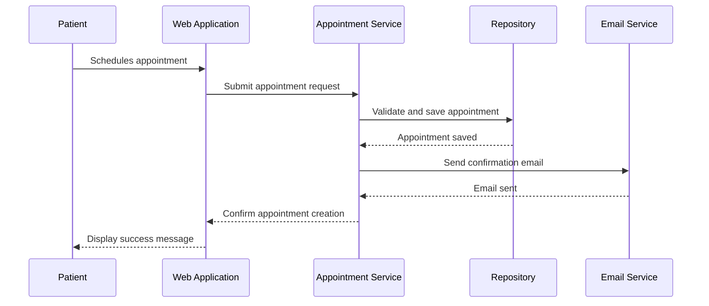

# Medical Scheduling System

## Overview

The **Medical Scheduling System** is a full-stack application designed to handle the scheduling and management of medical appointments for doctors and patients. The system follows a **Domain-Driven Design** (DDD) approach and employs a modular architecture that separates domain logic, application services, and infrastructure.

----------

## Features

### For Patients

-   **User Registration and Profile Management**: Register as a patient, update profile information (name, phone number, address, etc.), and view/edit personal details.
-   **Appointment Scheduling**: Book appointments with doctors, choose a date and time, and receive email confirmations.
-   **Appointment Management**: View scheduled appointments, reschedule, or cancel appointments.

### For Doctors

-   **Availability Management**: Set available dates and times for patient consultations.
-   **Appointment Overview**: View upcoming appointments and patient details.

### Notifications

-   **Email Notifications**: Automated email notifications for patients confirming appointments and sending reminders.

----------

## Architecture

The system is built on a layered architecture using principles of **Separation of Concerns** and **Dependency Injection**:

1.  **Domain Layer**: Contains core business entities (`Patient`, `Doctor`, `Appointment`) and aggregates.
2.  **Application Layer**: Provides services to interact with the domain and implements business use cases (`AppointmentService`, `PatientService`).
3.  **Infrastructure Layer**: Handles database interactions through repositories and external services like email notifications.

----------

## Diagrams

### Class Diagram

----------

### Sequence Diagram (Appointment Scheduling)

----------

## Key Technologies

-   **Frontend**: [Blazor](https://dotnet.microsoft.com/apps/aspnet/web-apps/blazor)
-   **Backend**: ASP.NET Core with Razor Components
-   **Database**: MySQL
-   **Notifications**: SendGrid for email integration
-   **Styling**: MudBlazor for UI components

----------

### Application Services

#### `AppointmentService`

Handles appointment scheduling, rescheduling, and notifications.

----------

### Email Notifications

**EmailService** sends confirmation and reminder emails using SendGrid.

----------

## Setup Instructions

### Prerequisites

-   .NET 7 SDK
-   MySQL database
-   SendGrid API key for email notifications

### Run Locally

1.  **Clone the Repository**
      
 

       `git clone https://github.com/username/MedicalScheduling.git
        cd MedicalScheduling` 
    
2.  **Set Up Environment Variables** Update `appsettings.json` with your database and SendGrid configuration.
    
3.  **Run Migrations**
    
   

`dotnet ef database update` 
    
4.  **Start the Application**
    
    
`dotnet run` 

----------

## Tests

Run unit and integration tests:

    `dotnet test` 

----------

## Future Enhancements

1.  **SMS Notifications**: Integrate with Twilio for SMS reminders.
2.  **Multilingual Support**: Add support for multiple languages.
3.  **Enhanced Reporting**: Generate analytics for appointments and user engagement.

----------

This README provides a comprehensive overview of the system, including diagrams, key components, and setup instructions, making it ideal for presentations and onboarding.
